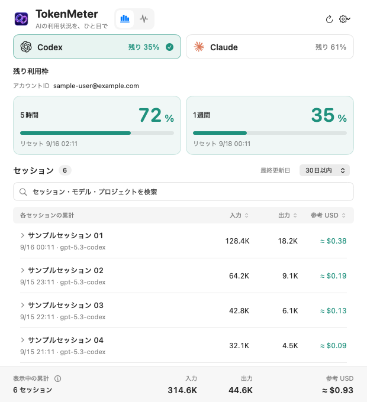
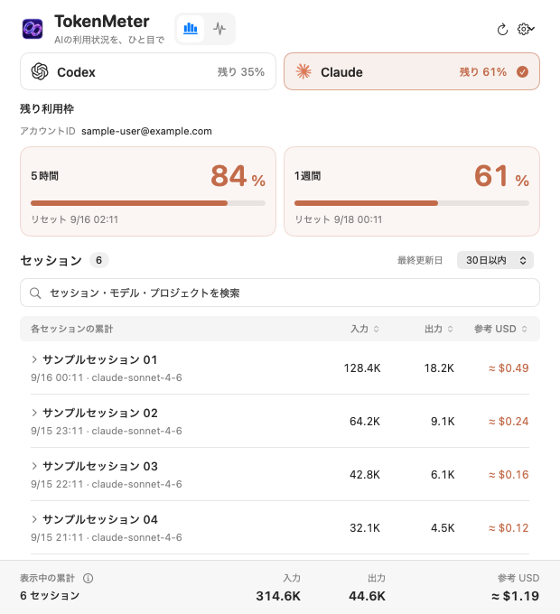

# TokenMeter

**CodexとClaude Codeの残り利用枠を、macOSのメニューバーで確認。**

TokenMeterは、残り利用枠・セッション別のトークン使用量・API料金換算の参考額を表示するmacOSアプリです。Swift／SwiftUI／AppKitで実装し、ローカルログをアプリ内で集計します。専用サーバーや有料のモデル呼び出しは不要です。

> 表示する参考料金は、API公開単価によるUSDの概算です。サブスクリプションへの追加請求額ではありません。

## 使用画面

Codexの残り利用枠と、セッション別のトークン使用量・参考料金を一覧で確認できます。



<details>
<summary>Claude Codeの使用画面</summary>



</details>

画像はアプリの画面描画機能で作成した表示例です。アカウント・セッション名・使用量・利用枠は公開用のサンプルデータです。

## 主な機能

- **メニューバー表示** — Codex／Claudeの主要な利用枠のうち、残りが最も少ない枠を表示。
- **セッション別の使用量** — 入力・出力トークン数、キャッシュの内訳、モデル別の参考料金を確認。
- **検索・絞り込み・並び替え** — セッションの最終使用日時で絞り込み、トークン数や参考料金で並び替え。
- **サービスの稼働情報** — OpenAI／Anthropicの公式ステータスと進行中のインシデントを表示。
- **Claude Code連携** — 既存のステータスライン表示を維持して利用枠を取得。
- **ログイン時の自動起動** — アプリ内の設定から切り替え。

## 動作環境

| 項目 | 要件 |
| --- | --- |
| OS | macOS 14以降 |
| CPU | Apple Silicon（現在のビルド対象） |
| ビルド | XcodeまたはCommand Line Tools |
| Codexの利用枠取得 | ログイン済みのCodex CLI |
| Claudeの利用枠取得 | Claude Codeと、利用枠を含むstatusLine通知 |

ビルド済みアプリの実行にPythonや開発ツールは不要です。Codex CLIがなくても、アプリとClaude側の機能は動作します。UIは日本語、参考料金はUSDで表示します。

## インストール

このリポジトリをcloneまたはダウンロードし、リポジトリのルートで実行してください。

### ビルドして起動

Command Line Toolsが未導入の場合は、先にインストールします。

```sh
xcode-select --install
```

```sh
bash build.sh
codesign --verify --deep --strict TokenMeter.app
open TokenMeter.app
```

ルートに `TokenMeter.app` が生成されます。ビルドはローカルのad-hoc署名を使用し、配布用の署名・公証は行いません。

### Applicationsにインストール

```sh
bash install.sh
```

ビルドと署名検証の後、起動中のTokenMeterを終了し、`/Applications/TokenMeter.app` を置き換えて起動します。更新時も同じコマンドを使用できます。

別の場所へ配置する場合は、書き込み可能な既存ディレクトリを指定します。

```sh
mkdir -p "$HOME/Applications"
TOKENMETER_INSTALL_DIR="$HOME/Applications" bash install.sh
```

手動で移動する場合は、アプリを終了してから `TokenMeter.app` 全体を移動してください。

## 使い方

1. アプリを起動すると、Dockではなくメニューバーに項目が表示されます。
2. メニューバーの項目をクリックして詳細画面を開きます。
3. **TokenMeter**画面でCodex／Claudeを選び、利用枠・リセット時刻・セッション一覧を確認します。
4. セッションの行をクリックすると、正確なトークン数、キャッシュの内訳、モデル別料金が展開されます。
5. **Status**画面で各サービスの稼働情報を確認します。歯車メニューから自動起動、Claude連携、終了を操作できます。

入力／出力／参考USDの見出しをクリックすると昇順・降順が切り替わります。見出し左の矢印ボタンで並び替えを解除すると、更新日時順に戻ります。一覧下部には表示中セッションの累計を表示します。

### Claude連携を有効にする

歯車メニューから「Claude連携を有効にする」を選び、Claude Codeで応答を受け取ってください。利用枠を含む公式statusLine通知を受け取ると表示が更新されます。

- 変更する設定はClaude Codeの `settings.json` の `statusLine` 項目です。既存コマンドをラップし、その表示と他の設定を維持します。
- 連携解除時は元の `statusLine` を復元します。ユーザーが後から別の設定に変更した場合は上書きしません。
- Pro／Maxでも応答後の通知を待つ場合があります。API・プロキシ等の接続先では利用枠が通知されない場合があります。
- 通知前は「未取得／通知待ち」となります。ローカルログがあればトークン数と参考料金の集計は利用できます。

## 表示と集計の仕様

### 残り利用枠

メニューバーには、利用枠を取得できたサービスのロゴと残り割合を表示します。主要枠が複数ある場合は残りが最も少ない枠を選び、別モデル専用枠は詳細画面の「ほかのモデル別利用枠」に分けて表示します。

- 取得元・取得時刻・補足説明は、利用枠カードのⓘから確認できます。
- 10分以上前の取得値にはメニューバーで `·` を添えます。
- リセット時刻を過ぎても、未取得の値を残り100％とは推測しません。不明値は `—` または「未取得」と表示します。
- Codexの直接取得に失敗した場合は、ログの最終値と取得時刻を利用します。

### ログの対象範囲

| サービス | 既定の読み取り先 | 補足 |
| --- | --- | --- |
| Codexアプリ／CLI | `~/.codex/sessions`、`~/.codex/archived_sessions` | `CODEX_HOME` 指定時はその配下。起動したエージェントは親チャットに合算し、展開時に個別表示。Guardian内部レビューは除外 |
| Claude Code | `~/.claude/projects` | `CLAUDE_CONFIG_DIR` 指定時はその配下。サブエージェントは別行 |

対象は**直近30日以内に更新されたローカルログ**です。「今日更新」「7日以内」「30日以内」はセッションの最終使用日時による絞り込みであり、表示値は各セッション全体の累計です。指定期間内だけの消費量ではありません。

通常のClaudeチャット、ブラウザだけに存在する会話、別端末やリモート環境だけにあるログは対象外です。Codexの累計スナップショットやClaudeのストリーミング応答など、同一使用量の重複を除いて集計します。

Codexの親子関係は子ログ先頭の `session_meta` から取得します。一覧の「子タスク N」を含む行を展開すると、親・子それぞれの使用量、参考料金、モデル、親との関係、IDのコピーボタンを確認できます。一覧の数値は親子の合計です。古いキャッシュで欠けていた親子情報はログ先頭から補完し、通常は保存済みの使用量と差分読み取り位置を維持します。`collabAgentToolCall` の呼び出し履歴だけから使用量を推定することはなく、対象期間内の子ログに使用実績がない場合は内訳に表示されません。

### 更新タイミング

Claude連携は公式の `statusLine.refreshInterval` を60秒に設定します。これは通知コマンドの定期実行であり、サーバーへの毎分の問い合わせを保証しません。Claude Codeが保持する値の遅れは残る場合があります。連携解除時は更新間隔を含む元のstatusLine設定を復元します。

| データ | 更新タイミング |
| --- | --- |
| ローカルログ | 30秒ごと。初回走査・差分読み取りはファイル単位で最大4並列。未変更ログはキャッシュを再利用 |
| Codexの利用枠・アカウント情報 | 通常1分ごと、および更新ボタン操作時 |
| Claudeの利用枠 | 応答時および60秒ごとのstatusLine通知。TokenMeterは30秒ごとに読み込み |
| 公式ステータス | 起動時、5分ごと、Status画面への切り替え時、更新ボタン操作時 |
| 公式単価 | 起動中に通常1日1回確認。取得失敗時は再試行 |

Status画面には全体状態、関連サービス、進行中のインシデントを表示し、障害中のサービスは関連サービスの絞り込みにかかわらず表示します。障害情報がある間はメニューバーの赤い丸が点滅し、正常状態の取得後に消えます。取得失敗時は直前の状態を保持します。各カードから公式ページを開けます。

公開ステータスは各社の集約情報であり、契約プラン・地域・モデルごとの可用性を保証するものではありません。

### アカウント表示

- **Codex** — `codex app-server` の `account/read` で取得したアカウントID（ChatGPTのメールアドレス）を表示します。最後に正常取得できた値をローカルに保持するため、一時的な取得失敗時も表示が残ります。利用枠は `account/rateLimits/read` で取得します。
- **Claude** — `~/.claude.json` のメールアドレス、なければアカウントUUIDを表示します。`CLAUDE_CONFIG_DIR` 指定時はそのディレクトリ内の `.claude.json` だけを参照します。30秒ごとに読み直し、読み取りに失敗した場合は「未取得」と表示します。現在の認証状態を検証するものではありません。

## 参考料金

APIの公開単価を使い、**標準処理・短コンテキスト**の条件で換算します。実際のAPI請求額や、サブスクリプションの利用枠消費率とは異なる指標です。

- 入力トークン数には通常入力・キャッシュ読取・キャッシュ書込を含め、料金はそれぞれの単価で計算します。Claudeの1時間キャッシュは記録がある場合に区別します。
- 出力に含まれる推論トークンを重複加算しません。
- Fast／Priority、長コンテキスト割増、地域料金、画像・検索・ツール料金、税、為替換算は含みません。
- 未知のモデルは「単価未設定」とし、合計には算定できる金額と「未算定」を併記します。

同梱単価・確認日・出典は [`Sources/pricing.json`](Sources/pricing.json) に記載しています。起動中は公式料金表を定期確認し、モデルIDと必要な単価を解析できたものを `official-pricing.json` に保存して次回集計から反映します。通信・解析失敗時や、公式表からモデル・必要な単価が消えた場合は以前の値を保持します。確認できない単価は推測追加しません。

### 単価のカスタマイズ

`~/Library/Application Support/UsageBar/pricing.json` に、同梱ファイルと同じ `models` 形式でモデル単価を設定すると、次回更新時に適用されます。各値の単位は **USD／100万トークン**です。

適用の優先順位は次のとおりです。

1. ユーザー設定の `pricing.json`
2. 自動取得した `official-pricing.json`
3. アプリ同梱の単価

## データとプライバシー

実行時データは `~/Library/Application Support/UsageBar/` に保存します。旧名称のディレクトリを維持しているのは、既存の設定を引き継ぐためです。

保存するデータは次のとおりです。

- セッション名・作業ディレクトリ・使用量などの集計メタデータ
- CodexのアカウントID（メールアドレス）と利用枠、Claudeの利用枠通知から取得した使用率・時刻
- Claude連携設定と、復元用の元のstatusLine項目
- ユーザー単価、自動取得した単価、単価確認の日時・結果

会話本文や認証情報をキャッシュへ保存せず、セッションデータを外部に送信しません。外部通信は、公式料金表・公開ステータス・アカウント情報と利用枠の読み取りに使用します。モデルへのプロンプト送信、利用枠のリセット、追加購入は行いません。

不具合報告でログや画面を共有する際は、メールアドレス・セッション名・作業パスなどの個人情報を除いてください。

## よくある質問

### Claudeのロゴや利用枠が表示されない

連携を有効にしただけでは、メニューバーにロゴは表示されません。利用枠を含むstatusLine通知を受信する必要があります。[Claude連携](#claude連携を有効にする)を確認してください。

### Codexの利用枠が更新されない

Codex CLIにログイン済みか確認し、詳細画面の更新ボタンを押してください。直接取得できない場合はログの値を表示するため、ⓘの取得元・取得時刻も確認してください。

### UsageBarから更新できるか

旧版を終了してからTokenMeterを起動してください。保存先とBundle ID（`local.tokenmeter.TokenMeter`）を維持し、設定・キャッシュ・ユーザー単価を引き継ぎます。Claude連携の旧ヘルパーは起動時に更新し、元のstatusLineの復元情報を保持します。ログイン時の自動起動は再設定が必要な場合があります。

## 開発

ビルドと検証はリポジトリのルートで実行します。

```sh
bash build.sh
codesign --verify --deep --strict TokenMeter.app
bash Tests/run.sh
```

| パス | 役割 |
| --- | --- |
| `Sources/TokenMeter.swift` | メニューバー・詳細画面・更新処理 |
| `Sources/Collector.swift` | ログの差分読み取り・重複排除・使用量集計・利用枠取得 |
| `Sources/PricingUpdater.swift` | 公式単価の取得・更新 |
| `Sources/ProviderStatus.swift` | 公式ステータスの取得 |
| `Sources/SessionSorting.swift` | セッション一覧の並び替え |
| `Sources/ClaudeBridge.swift`、`Sources/BridgeManager.swift` | Claude連携と設定の復元 |
| `Sources/pricing.json`、`Sources/Assets/` | 同梱単価・画像リソース |
| `Tests/` | 合成ログと一時設定を使う回帰テスト |
| `build.sh`、`install.sh` | ビルド・署名・ローカルインストール |

`TOKENMETER_BUILD_DIR` でビルドキャッシュの場所を変更できます。旧 `USAGEBAR_BUILD_DIR` も利用できます。生成された `TokenMeter.app/` は直接編集せず、ソースから再生成してください。開発上の詳細は [`AGENTS.md`](AGENTS.md) を参照してください。

不具合報告にはmacOSのバージョン、対象サービス、再現手順、期待した動作と実際の動作を添えてください。

## 参考資料・クレジット

- [Codex App Server](https://developers.openai.com/codex/app-server#auth-endpoints)
- [OpenAI API料金](https://developers.openai.com/api/docs/pricing)
- [OpenAI Status](https://status.openai.com/)
- [Claude Code statusLine](https://code.claude.com/docs/en/statusline)
- [Claude API料金](https://platform.claude.com/docs/en/about-claude/pricing)
- [Anthropic Status](https://status.anthropic.com/)

アプリアイコンはTokenMeter専用のデザインです。原画と制作情報は [`Sources/Assets/`](Sources/Assets/) にあります。サービス識別用ロゴの画像出典は [ChatGPT（Wikimedia）](https://thumb.wikimedia.org/wikipedia/commons/thumb/e/ef/ChatGPT-Logo.svg/960px-ChatGPT-Logo.svg.png) と [Claude（Seeklogo）](https://images.seeklogo.com/logo-png/55/2/claude-logo-png_seeklogo-554534.png) です。ChatGPTロゴはmacOSの明暗に合わせて表示し、Claudeロゴは元画像の色を維持します。

TokenMeterはOpenAI／Anthropicの公式アプリではありません。各サービス名・ロゴはそれぞれの権利者に帰属します。
